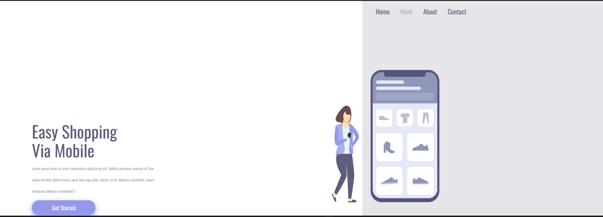
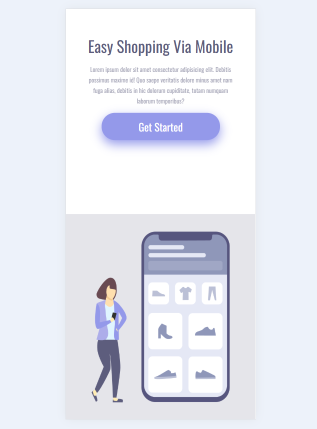

# 🛒 Easy Shopping

> Um layout moderno e responsivo de página de compras online,
> desenvolvido como projeto prático no curso **DevClub**.

---

## 🖥️ Preview Desktop



## 📱 Preview Mobile



---

## ✨ Sobre o projeto

O **Easy Shopping** simula a página de apresentação de um serviço de compras online, com um visual limpo, moderno e totalmente responsivo.

O projeto foi desenvolvido durante as aulas de **HTML e CSS com responsividade** do **DevClub**, com foco em:

- Estruturação semântica de HTML;
- Estilização com CSS puro;
- Layout que se adapta perfeitamente a **qualquer tamanho de tela**.

---

## 🧠 Tecnologias utilizadas


---

## 📁 Estrutura do projeto

```bash
easy-shopping/
├── assets/
│   ├── desktop.png     # Preview da versão desktop
│   └── mobile.png      # Preview da versão mobile
├── index.html          # Estrutura da página
└── styles.css          # Estilos e responsividade
```

---

## 📱 Responsividade

O layout foi pensado para funcionar bem em qualquer dispositivo:

| Desktop | Mobile |
|---|---|
|  |  |

---

## 🚀 Como visualizar o projeto

```bash
# Clonar o repositório
git clone https://github.com/lucasairess/easy-shopping.git

# Entrar na pasta
cd easy-shopping
```

Depois é só abrir o `index.html` no navegador.  
No VS Code, você pode usar a extensão **Live Server** para visualização com atualização em tempo real.

---

## 🎯 O que aprendi com esse projeto

- Estruturar uma página HTML do zero com semântica;
- Estilizar layouts com CSS puro;
- Aplicar **media queries** para responsividade;
- Organizar arquivos de um projeto web de forma profissional;
- Trabalhar com tipografia, espaçamentos e hierarquia visual.

---

## 📌 Próximos passos

- [ ] Adicionar efeitos de hover mais elaborados nos botões;
- [ ] Implementar animações suaves com CSS;
- [ ] Expandir o layout com novas seções (produtos, carrinho, etc.);
- [ ] Implementar dark mode.

---

## 👨‍💻 Autor

<table>
  <tr>
    <td align="center">
      <b>Lucas Aires</b><br/>
      Estudante de programação no DevClub<br/>
      Brasília, DF 🇧🇷<br/><br/>
      <a href="https://www.linkedin.com/in/lucasairess/" target="_blank">
        
      </a>
      &nbsp;
      <a href="https://github.com/lucasairess" target="_blank">
        
      </a>
    </td>
  </tr>
</table>

---

<p align="center">
  Feito com 💙 e muita dedicação durante os estudos no <strong>DevClub</strong>
</p>
